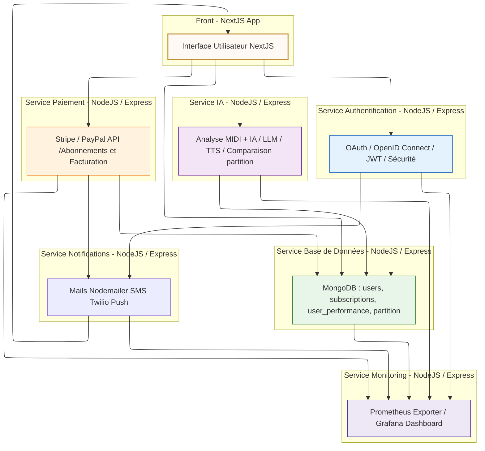
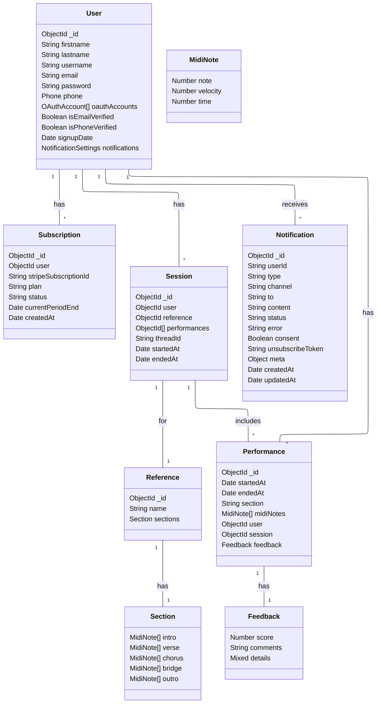
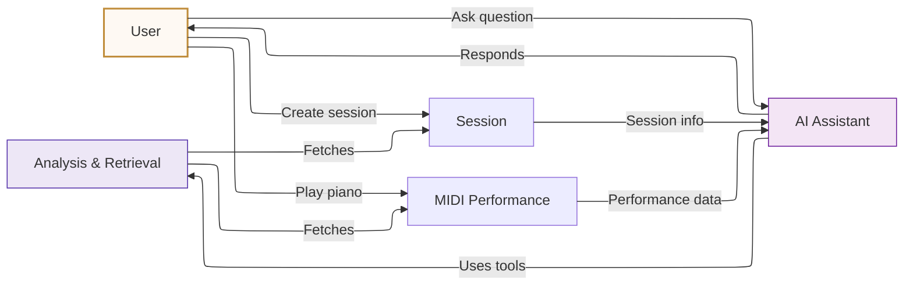

# SonataAI Frontend

Océane Kabasele

## Overview
This is the frontend application for SonataAI, a web-based AI application. The frontend is built with modern web technologies to provide an intuitive user interface for interacting with the SonataAI backend services.

## Technologies
- Next.js
- TypeScript
- Tailwind CSS
- Mailpit : http://localhost:8025/

## Getting Started

### Prerequisites
- Node.js (v14.0.0 or later)
- npm or yarn

### Installation
```bash
# Clone the repository
git clone <repository-url>

# Navigate to the project directory
cd front

# Install dependencies
npm install
# or
yarn install
```

### Development
```bash
# Start the development server
npm run dev
# or
yarn dev
```

### Building for Production
```bash
# Build the application
npm run build
# or
yarn build
```

## Architecture logicielle



## UML




## AI Pipeline

